# App Tareas.

## Ejecución:
Instalar node.js

### Iniciar app:
*	Iniciar terminal de visual studio code o terminal del sistema.
*	Acceder a la ruta de carpetas donde se encuentre el proyecto a través del comando cd en caso del terminal. 
```
    cd C:\Users\yeiimacc \Escritorio\ Node\Aplicacion_Tareas
```

*	 En visual studio code abrir el proyecto e iniciar una nueva terminal.
*	Iniciar aplicación comando:
```
    node app
```

## Opciones del menú:
**Para desplazarse en las opciones se usan las flechas del teclado y para aceptar se usa Enter.**

### 1. Crear Tarea:
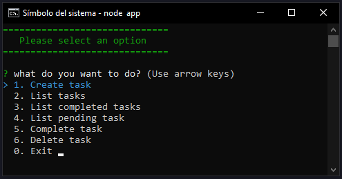

Digitar tarea a realizar.
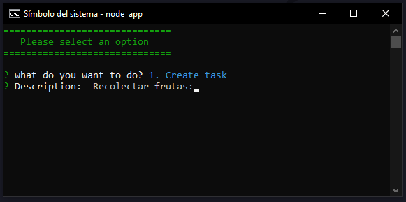

Enter para aceptar y Enter nuevamente para continuar.
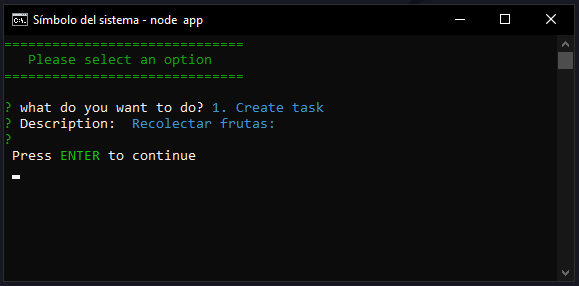

**Nueva tarea, se repite el proceso.**
Manzanas.
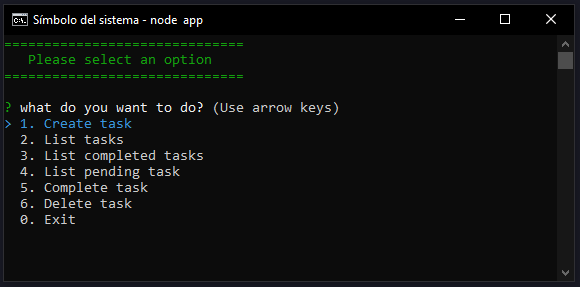
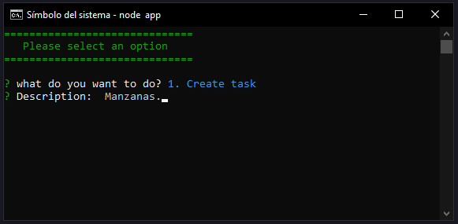
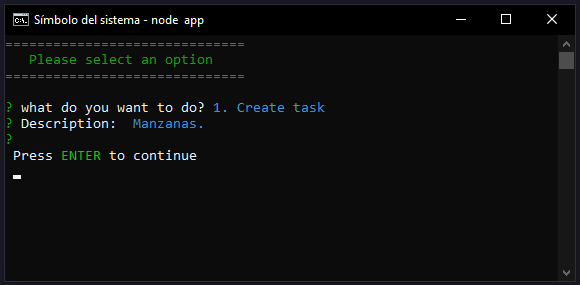

Se repite con:
Uvas.
Naranjas.


### 2. Lista de tareas.
Fecha abajo para mover el indicador y enter para acceder.
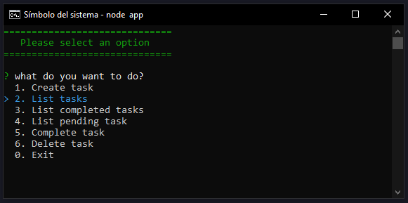
 
Lista de tareas.
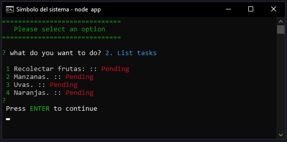

Se encuentran las tareas ingresadas junto a la tarea principal de recolectar fruta. Todas se encuentran pendientes por completar.


### 3. Listar de tareas completas:
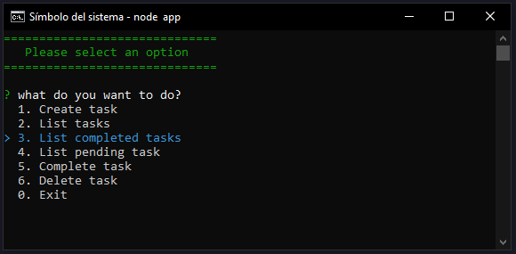

En el momento no se ha completado ninguna tarea por lo cual la lista será vacía.
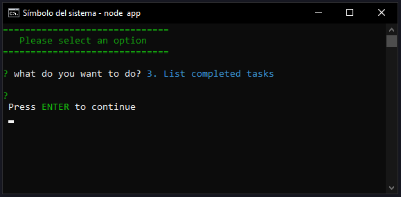
 
 


### 4. Lista de tareas pendientes.
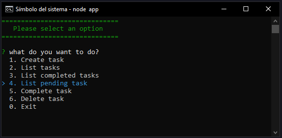

En el momento todas las tareas están pendientes.
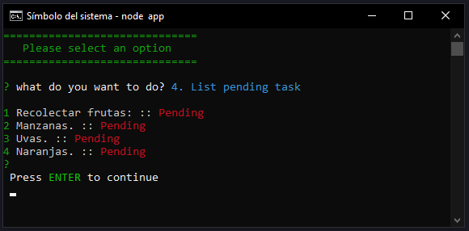


### 5. Completar tarea.
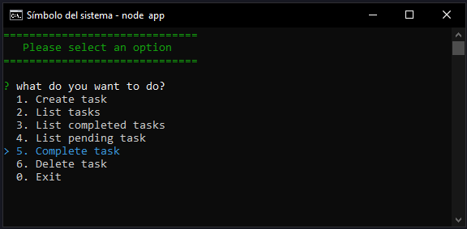 

Para seleccionar:
SPACE – para seleccionar de uno en uno.
a – Para seleccionar todas.
i – Para invertir la selección actual.
ENTER – Para procesar la selección.
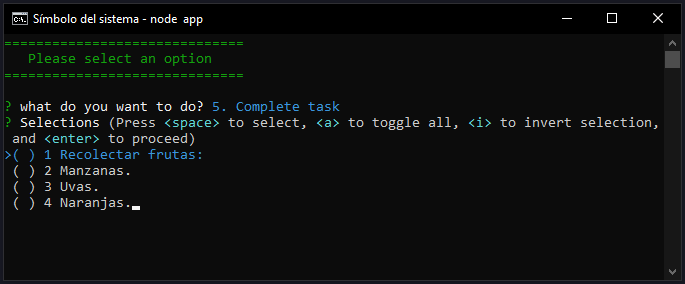

Tareas completadas:
Recolectar Manzanas y Naranjas.
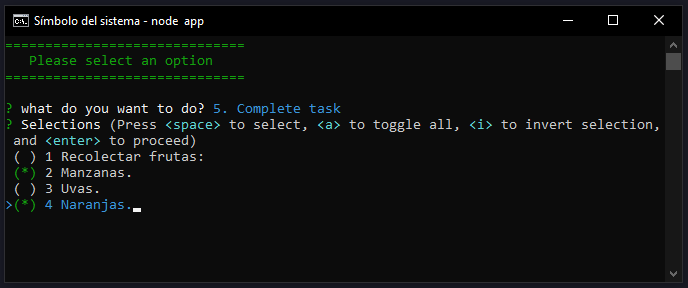 

ENTER – Para procesar selección.
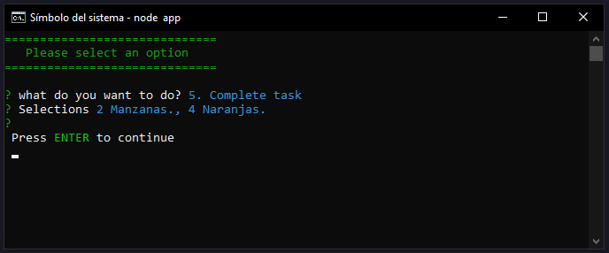

Ahora se puede repetir el paso 3 y 4.
Lista de tareas completadas:
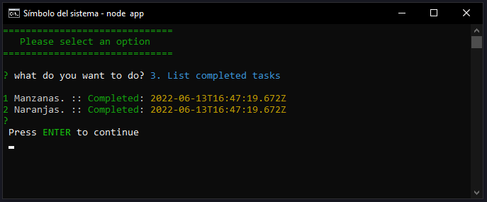

Lista de tareas pendientes:
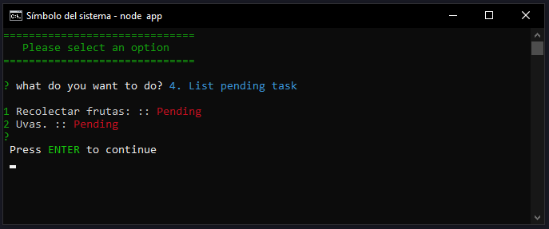
 


### 6. Eliminar tarea
Para este ejemplo se agregará una tarea nueva y luego se elimina (Peras.).
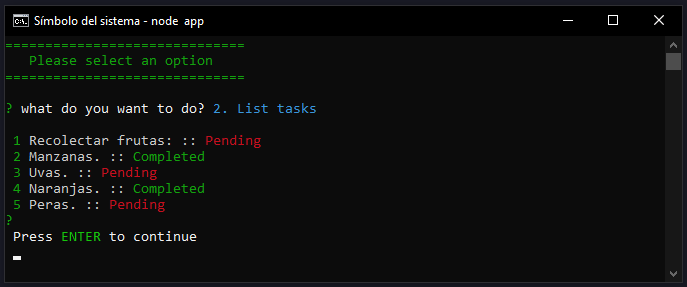

6 - Eliminar tarea:
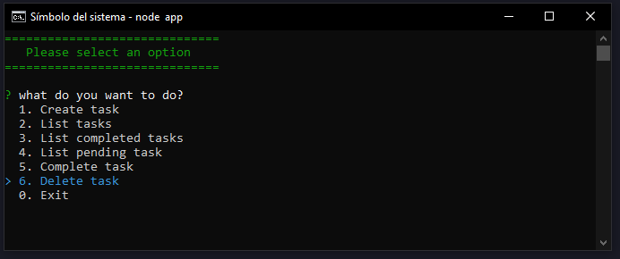
 
Seleccionar opción a eliminar (Peras) y ENTER.
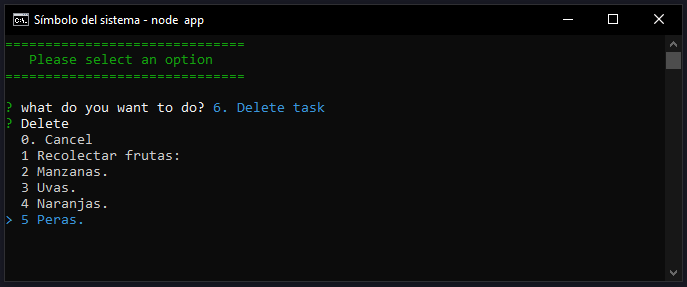 

Confirmar eliminar.
Aceptar con Y o ENTER | N para cancelar.
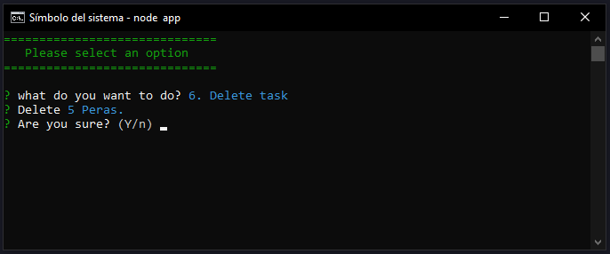 
 
Tarea eliminada.
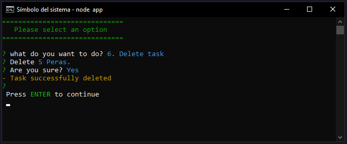 

Para verificar, ver lista de tareas.
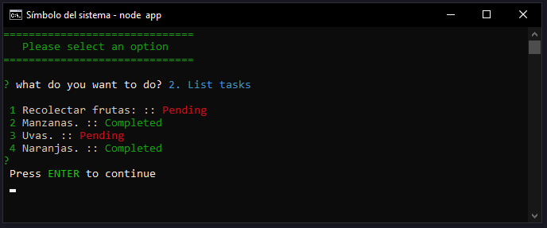
 


### 0. Exit para salir de la aplicación.
Se aclara que los datos se guardan en un archivo local JSON, de esta forma al terminar e iniciar la aplicación, los datos no se perderán.
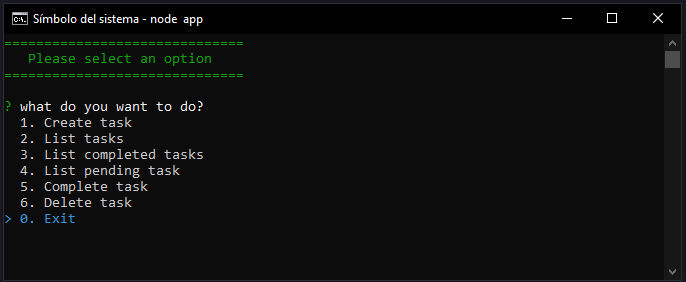
